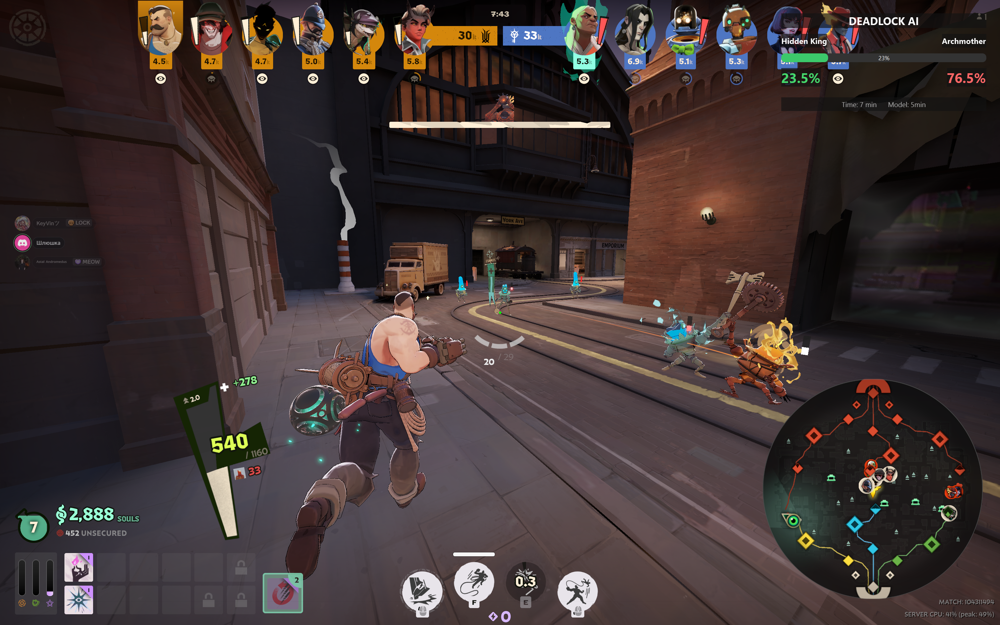
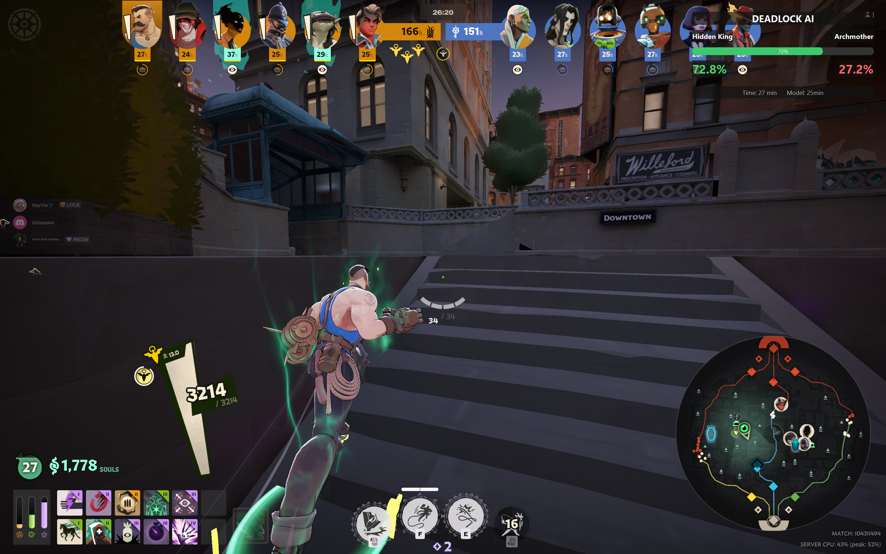
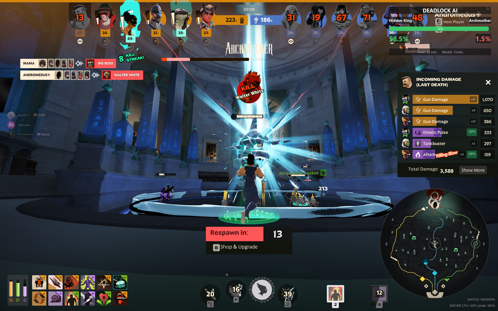
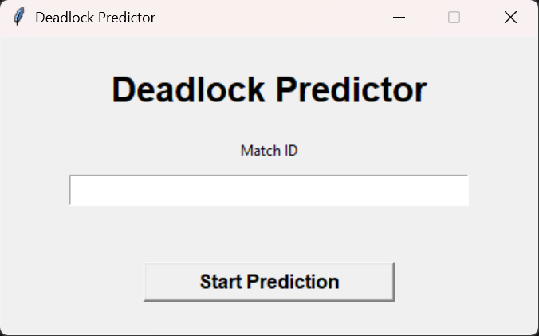
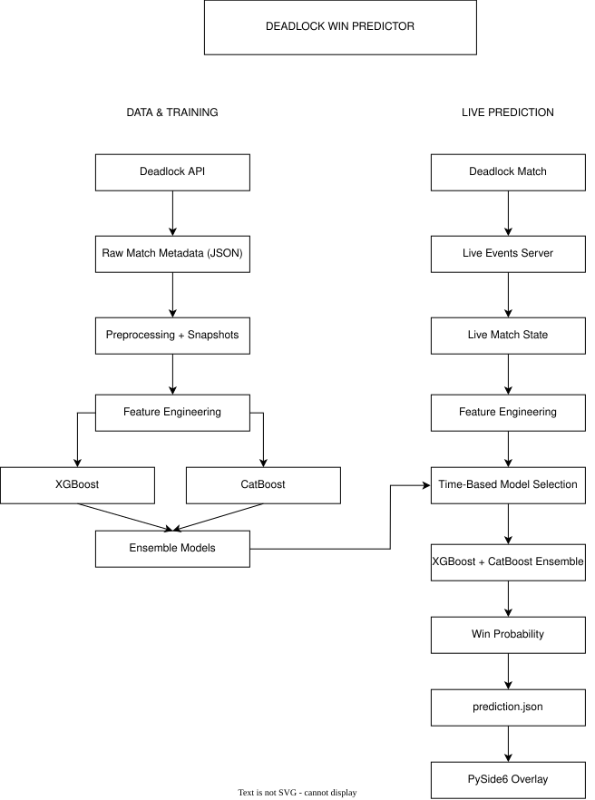

# Deadlock Match Win Probability Predictor

Real-time machine learning system for predicting Deadlock match win probabilities, with a live in-game overlay.

## Overview

Deadlock Match Win Probability Predictor is an end-to-end machine learning project that estimates the probability of a team winning a Deadlock match from the current game state.

The system contains:

- Historical match data for model training
- Feature engineering over player-level and team-level statistics
- XGBoost and CatBoost are combined into the final ensemble model.
- Separate models for different stages of a match
- A Rust-based live event server
- A Python live prediction script
- A PySide6 in-game overlay
- A standalone Windows launcher

The project is designed to run a complete live application rather than only offline ML experiments.

## Features

- **Real-time predictions** from live match data
- **Time-specific pre-trained models** for 5, 10, 15, 20, 25, 30, 35, and 40 minutes.
- **XGBoost and CatBoost ensemble** for final prediction
- **Feature engineering** using team economy, combat, objectives, heroes, lane assignment, and individual player-related statistics.
- **In-game overlay** displaying every minute's current win probability
- **Standalone Windows release** with compiled application components and a simple launcher
- **No Python or Rust installation required** when using compiled release

## Demo

### In-game overlay

The overlay displays the current estimated win probability and the game time, with additional info about the model used for prediction.

### Launcher

The launcher accepts a match ID and starts the required application components.

## How it works

The system has two main pipelines: an offline training pipeline and a live prediction pipeline. It can be explained by several independent components:

- **Data Collection** - retrieves historical match metadata.
- **Preprocessing** - converts raw match metadata into polished training snapshots
- **Model training** - trains the time-specific XGBoost and CatBoost models and creates an Ensemble model
- **Live Event Server** - provides the live match events stream
- **Live Predictor** - maintains live state, builds live features, selects the appropriate model, and generates predictions
- **Overlay** - displays prediction in-game
- **Launcher** - combines live event server, live predictor, and overlay into one simple application

### Offline training pipeline

Historical match metadata is collected through the Deadlock API and stored as individual JSON files. The preprocessing script extracts snapshots from the match timeline data and creates match-level datasets containing both teams and the winner label.

The training pipeline then loads a snapshot dataset, builds team- and player-level features, and engineers additional features. XGBoost and CatBoost models are then trained and combined into a final ensemble model, which is then saved with feature-column definitions for live inference.

### Live prediction pipeline

During a live match, the launcher starts the live-events server and the predictor, which connects to the live event stream for the selected match. Incoming entity events update the current 'LiveMatchState'. Once both teams contain six players with the required information, the current state is converted into the model feature representation, and the model is selected according to the current game time. Then the ensemble model produces a win probability, which is written to 'prediction.json'. The PySide6 overlay reads the prediction and streams the overlay in-game.

Predictions are generated once per minute rather than for every individual event.

## Machine Learning

### Input Features

The model uses player and team-level statistics available from the match state, including:

- Kills
- Deaths
- Assists
- Networth
- Hero damage
- Objective damage
- Creepstat(souls killed and denied)
- Level
- Gpm(Gold per minute)
- Player healing
- Self healing
- Hero
- Assigned lane

The feature engineering also introduces comparative team-level features such as:

- Networth difference ratio
- Damage difference ratio
- Level difference
- Carry networth difference
- Team KDR difference
- Gpm difference
- Objective damage difference and ratio
- Carry share
- Networth distribution within a team
- Richest player relative to team average

Hero and lane assignment information is converted into one-hot encoded features so that the live feature representation matches the training representation.

### Time-specific models

The system uses several pre-trained models during different stages of the game:

For example, for the range 0-7.5 game minutes, a 5-minute model is used; for the range 7.5-12.5 10-minutes model is used, and so on till 40-minutes model.

### Ensemble

Each time-specific model is an ensemble of XGBoost and CatBoost.

For a feature vector 'X': P(win | X) = (P_XGBOOST(win | X) + P_CATBOOST(win | X)) / 2

### Model Evaluation

The training experiments evaluated test accuracy and ROC-AUC score on a stratified 80/20 train/test split.

For the 30-minute model, the models achieved:

| Model | Test Accuracy | ROC-AUC score |
| --- | --- | --- |
| XGBoost | 0.826 | 0.911 |
| CatBoost | 0.834 | 0.914 |
| Ensemble | 0.828 | 0.913 |

The training pipeline also include probability calibration curve observation and SHAP-based model explainability.

**Note** These metrics are from the documented 30-minute training experiment. Performance can vary between different match-time models, as it is much harder to predict the winning team at the beginning of the game and easier at the end.

## Download

A standalone Windows build is available from the GitHub Release page. **No Python or Rust installation required for the compiled release!**

**[Download the latest release](../../releases/latest)**

In order to run the application:
1. Download the latest Windows release.
2. Extract the ZIP archive.
3. Run 'DeadlockPredictor.exe'.
4. Enter the target Deadlock match ID.
5. Click **Start Prediction**.
6. The launcher starts the live event server, live predictor, and overlay automatically.
7. The overlay displays the current prediction while the match is running.
8. The launcher also provides a **Stop Prediction** button that terminates the running components. **It is really recommended to close the application using this button as sometimes during forced closing the overlay stays open and you need to close it using Task Manager.**

## Data

The complete raw dataset is **NOT** included in this repository, because of its size. I have collected over 20,000 matches(>75GB of data).

The repository contains the data collection and preprocessing code needed to document and reproduce the data pipeline. For more info, see ['data/README.md'](training/data/README.md).

However, the pre-trained ensemble models for each of the time-specific stages are available under ['models'](models/). The corresponding 'feature_columns.pkl' file defines the feature ordering expected by the trained models.

## Limitations, Known Issues and Future Prospects

This project has several important limitations:

- The predictions are statistical estimates, not guaranteed outcomes.
- Model performance depends on the quality and representativeness of training data.
- The live server requires the live-events data source to provide the required player-, team-, and game-state information.
- Historical and live data availability may change as the game and its API develop.

Also, there are several bugs, which I would try to fix in the future. For example, the time in the overlay sometimes breaks if the pause was used in-game.

Additionally, I plan to train deep learning models and add more features to increase the model's reliability. Also, in **NOT** near future, I would like to try to implement an item suggestion mechanism. Furthermore, the training data and models should be regularly updated, as the meta changes every day; however, I do not promise to do so. I will update it when I have free time.

## Disclaimer

This is an unofficial community-made project and is **not affiliated with, endorsed by, or sponsored by Valve Corporation**. 

Deadlock and related game assets, names, and trademarks belong to their respective owners.

The predictions produced by this software are statistical estimates for educational and experimental purposes. They should not be interpreted as guaranteed match outcomes.

## Credits

This project uses the [Deadlock API](https://github.com/deadlock-api/deadlock-api) for Deadlock match data and live event functionality. Huge appreciation to the developers of the Deadlock API. This project would not have been possible without their work.

The project also relies on open-source Python and machine-learning libraries including XGBoost, CatBoost, pandas, numpy, scikit-learn, Joblib, PySide6, and related dependencies. See the ['requirements'](requirements.txt) for specific versions used.

## License

This project is licensed under the **MIT License**. See [`LICENSE`](LICENSE) for the full license text.

Third-party software and upstream projects remain subject to their respective licenses.
